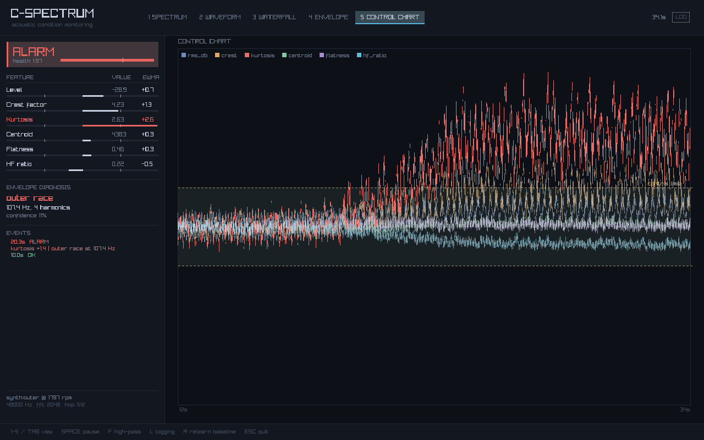
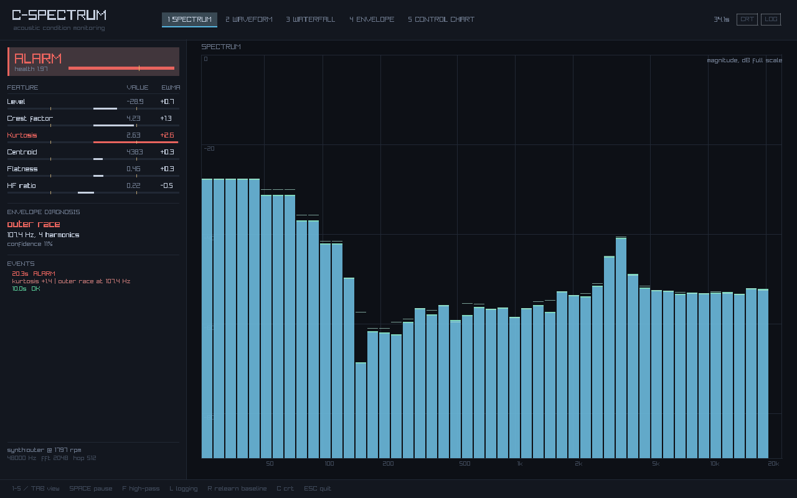
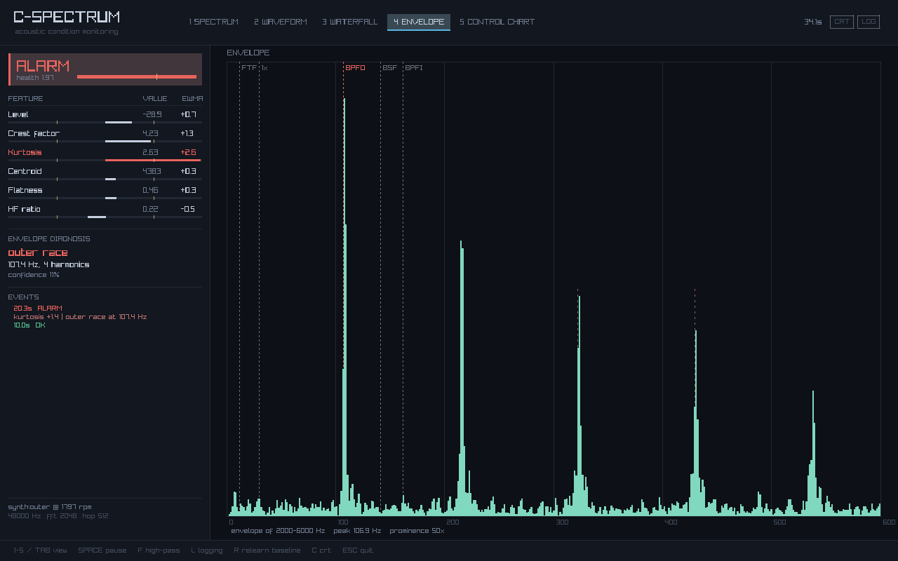
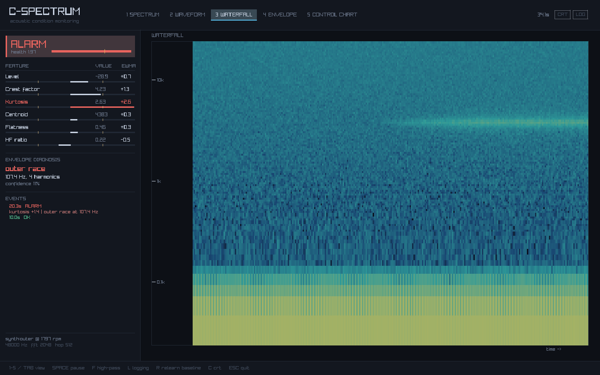
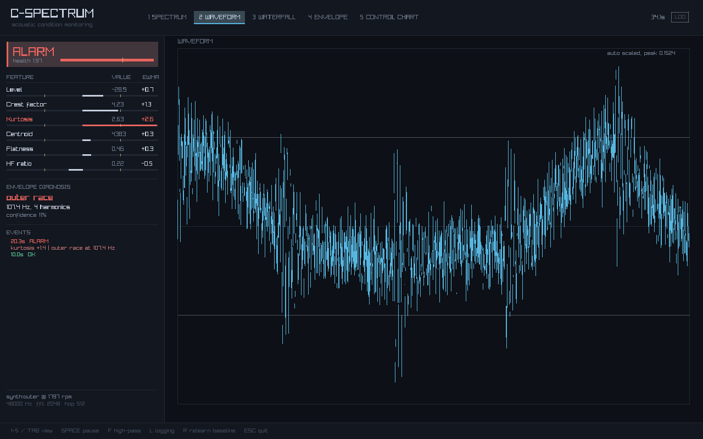

# C-Spectrum

**Listens to a machine, learns what it normally sounds like, and tells you when a bearing starts to fail.**

Written in C11 — real-time DSP, statistical process control and envelope analysis in about 4,900 lines, with 1,400 more of tests. The analysis core depends only on a FFT (KissFFT) and an audio backend (miniaudio); raylib is used for the window and is optional.

[**Play with it in your browser**](https://arkid-lutaj.github.io/c-spectrum/spindoctor/) · [**Live demo**](https://arkid-lutaj.github.io/c-spectrum/) · [**How it works**](docs/DESIGN.md)



*A synthetic outer-race bearing fault developing from 15 s. Kurtosis (red) leaves the control band while everything else stays inside it. The alarm fires at 20.3 s, and the envelope spectrum names the outer race.*

---

## What it does

A bearing that is starting to fail doesn't get louder. It starts *ticking* — each time a rolling element passes over the damaged spot it produces a tiny impact. Long before the overall noise level moves, the *shape* of the sound changes: it gets spikier.

C-Spectrum measures that. It:

1. **Learns a baseline.** For the first few seconds it just watches and records the mean and spread of six features.
2. **Watches for a shift.** Each feature goes onto an EWMA control chart. When one drifts outside its control limit and stays there, it raises an alarm and says *which* feature moved.
3. **Names the faulty part.** It demodulates the housing resonance to recover how often the impacts repeat, and matches that against the frequencies computed from the bearing's geometry. Outer race, inner race, ball, or cage.

The six features are level, crest factor, kurtosis, spectral centroid, spectral flatness, and high-frequency ratio. They're chosen because they fail *differently* — impacts push crest and kurtosis up while the level barely moves, whereas a rub raises the level and flatness with no periodicity at all. The pattern tells you something about what kind of fault it is.

## Try it in 30 seconds

No microphone or recordings needed — there's a machine simulator built in.

```bash
cmake -B build -DCMAKE_BUILD_TYPE=Release
cmake --build build

# a healthy machine
./build/cspectrum --analyse --synth healthy --rpm 1797

# an outer race fault that develops from 15 s
./build/cspectrum --analyse --synth outer --rpm 1797
```

```
 final state   ALARM
 alarms        1
 first alarm   20.3 s

 baseline (learned over the first 10 s)
   feature                mean        sigma        final       ewma
   rms_db             -31.0945       2.3247     -29.1988      +0.84
   crest                3.4647       0.5428       2.7549      +0.92
   kurtosis             2.5671       0.2765       2.7031      +3.44  <-- tripped
   centroid          3208.9250     816.6946    3277.5757      +0.07
   flatness             0.3882       0.0495       0.3850      -0.05
   hf_ratio             0.1991       0.0517       0.1622      -0.65

 envelope analysis (2000-6000 Hz band)
   strongest line  106.9 Hz
   verdict         outer race at 107.4 Hz
   harmonics       4
   confidence      12%

 events
      9.99 s  LEARNING -> OK        -
     20.34 s  OK       -> ALARM     kurtosis +1.4 | outer race at 107.4 Hz
```

Drop `--analyse` to get the window instead.

## The interface

Five views over the same data. `1`–`5` or `Tab` to switch.

| | |
|---|---|
|  |  |
| **Spectrum** — log frequency, dB. The hump at 3–4 kHz is the housing resonance the impacts excite. | **Envelope** — the demodulated spectrum. The comb of evenly spaced peaks *is* the fault, and BPFO is marked so you can check the match yourself. |
|  |  |
| **Waterfall** — spectrum against time. You can watch the resonance band light up as the fault grows. | **Waveform** — the raw signal, drawn min/max per column so nothing is aliased away. |

The left panel is always there: current state, every feature's distance from its baseline, and the diagnosis. When an alarm fires, the reason is on screen, not buried in a log.

## SpinDoctor — the browser version

**[arkid-lutaj.github.io/c-spectrum/spindoctor](https://arkid-lutaj.github.io/c-spectrum/spindoctor/)**

Point your mic at a fan, a washing machine, a drill, or just tap the desk. It
tells you whether it sounds smooth, and how fast anything is knocking. You can
drop in an audio file instead, and there's a "learn this sound" button that
does the baseline thing — learn your fan, then hold a finger near a blade and
watch it notice.

It's the C in this repository compiled to WebAssembly with emscripten, not a
JavaScript rewrite, so there's one implementation of the DSP rather than two
that quietly disagree. The audio never leaves the page.

```bash
# needs emscripten on PATH; the built output is committed, so this is
# only needed if you change the C
./web/build.sh
node web/test_wasm.mjs     # wasm agrees with the native build
node web/test_page.mjs     # the page reaches the right verdicts
```

One thing worth knowing, because it's a nice illustration of why a single
number isn't enough: envelope prominence alone calls a steady two-tone hum
"knocking". Prominence is peak-over-median, and the little that leaks through
the envelope band from a periodic signal is *perfectly* periodic, so it scores
25 out of a possible ~50 on nearly no energy. The verdict therefore also
requires the sound to be spiky, because knocking means impacts and impacts are
short and sharp. `web/test_page.mjs` pins that case.

## Usage

```
cspectrum [options]              open the window
cspectrum --analyse [options]    run offline and print a report
```

**Input**

| | |
|---|---|
| `--mic` | capture from the default input (default) |
| `--wav FILE` | analyse a wav/mp3/flac recording |
| `--synth [FAULT]` | simulate a machine: `healthy` `outer` `inner` `ball` `imbalance` `rub` |
| `--rpm HZ` | shaft speed — needed to name a bearing fault |
| `--duration SEC` | stop after this long |

**Analysis**

| | |
|---|---|
| `--rate` `--fft` `--hop` | sample rate, FFT size, samples between analyses |
| `--window` | `hann` `hamming` `blackman` `flattop` |
| `--hp HZ` / `--no-hp` | high-pass cutoff |
| `--env-band LO:HI` | envelope band in Hz, default `2000:6000` |

**Monitor**

| | |
|---|---|
| `--baseline SEC` | learning period, default 10 |
| `--sigma L` | control limit in sigmas, default 4 |
| `--lambda X` | EWMA constant, default 0.2 |
| `--consecutive N` | points past the limit before alarming, default 3 |
| `--adapt R` | slow baseline drift for temperature/load, 0 = off |

**Output**

| | |
|---|---|
| `--csv FILE` | per-block telemetry |
| `--json FILE` | the whole run as JSON |
| `--capture DIR` | write one PNG per view and exit |

`--analyse` exits **3** if the run ended in an alarm, so it drops straight into a cron job or a CI check.

## Using it on a real machine

```bash
# a pump running at 1480 rpm, from a recording
cspectrum --wav pump.wav --rpm 1480 --analyse --csv pump.csv
```

Two things worth setting:

- **`--rpm`** — without it the tool still detects that something changed, but it can't name the part, because the defect frequencies are derived from shaft speed.
- **`--env-band`** — the default 2–6 kHz is a reasonable guess at the housing resonance. Find the real one by looking at the spectrum view for a broad hump, and set the band around it. This matters more than any other setting.

The bearing geometry defaults to a 6205 (9 balls, 7.94 mm ball, 39.04 mm pitch), which is the bearing used in the Case Western Reserve dataset, so the numbers can be checked against published results.

**On honesty:** a microphone in air is a worse sensor than an accelerometer bolted to the housing — it picks up the whole room and it can't see below a few tens of Hz. The signal processing is identical either way, and everything here works on an accelerometer stream if you have one. The simulator exists so the detector can be tested against a known answer; the numbers in this README come from it, not from a real failing bearing.

## Build

Needs CMake ≥ 3.14 and a C11 compiler. Raylib is fetched automatically for the GUI.

```bash
cmake -B build -DCMAKE_BUILD_TYPE=Release
cmake --build build
./build/cspectrum_tests
```

No window, no raylib download, no display needed — this is what CI builds:

```bash
cmake -B build -DCSPECTRUM_GUI=OFF
cmake --build build
```

CI builds on Linux (GCC and Clang), macOS (Clang) and Windows (MSVC).

One portability note: MSVC ships `<stdatomic.h>` but keeps C atomics switched
off unless you pass `/experimental:c11atomics`, even in C11 mode — and that
flag only exists from Visual Studio 2022 17.5. CMake adds it automatically, and
fails configuration with a useful message on anything older instead of dumping
an `#error` out of a system header.

## Tests

```
33/33 passed
```

The suite checks the DSP against values that are known from theory rather than against whatever the code happened to produce:

- crest factor of a sine is √2; kurtosis of the noise generator is 3 − 6/(5n) exactly; spectral flatness is ~0 for a tone and ~1 for white noise
- the high-pass really is −3.01 dB at its cutoff, measured by running a sine through it, at five different sample rates
- one FFT block per hop, and identical results whether samples arrive in 64s or 4096s
- bearing frequencies match the published 6205 values (BPFO 107.36 Hz, BPFI 162.19 Hz)
- the ring buffer survives a threaded producer with no discontinuities
- 10 minutes of steady input produces zero false alarms; a 3σ shift is caught in under 5 seconds
- a sustained fault is **not** absorbed into the baseline, even with adaptation turned up
- end to end: the simulator's outer, inner and ball faults are each correctly named, and a healthy machine is left alone across several random seeds

## Layout

```
src/
  cs_ringbuf.*     lock-free SPSC ring buffer (C11 atomics)
  cs_biquad.*      IIR sections, coefficients designed at runtime
  cs_analysis.*    high-pass, window, FFT, fixed-hop block loop
  cs_features.*    the six indicators
  cs_envelope.*    demodulation and bearing fault matching
  cs_monitor.*     baseline learning, EWMA control chart, alarm logic
  cs_synth.*       machine simulator with injectable faults
  cs_source.*      mic / wav / synth behind one interface
  cs_telemetry.*   async CSV writer on its own thread
  cs_engine.*      ties it together, keeps history for the UI
  cs_report.*      text report and JSON export
  cs_gui.c         raylib interface
tests/             33 tests
docs/DESIGN.md     why it's built this way
```

`cs_engine` and everything under it has no GUI dependency and does no allocation after init.

## What's in [DESIGN.md](docs/DESIGN.md)

The reasoning behind the parts that aren't obvious: why the analysis runs on a fixed hop instead of per frame, why `volatile` isn't enough for the ring buffer, why the baseline has to be frozen, why an EWMA chart catches a small drift that a threshold never would, and the bugs that were in the first version of this code and how the tests now stop them coming back.

## License

MIT. Dependencies keep their own: raylib (zlib), KissFFT (BSD-3), miniaudio (public domain).
